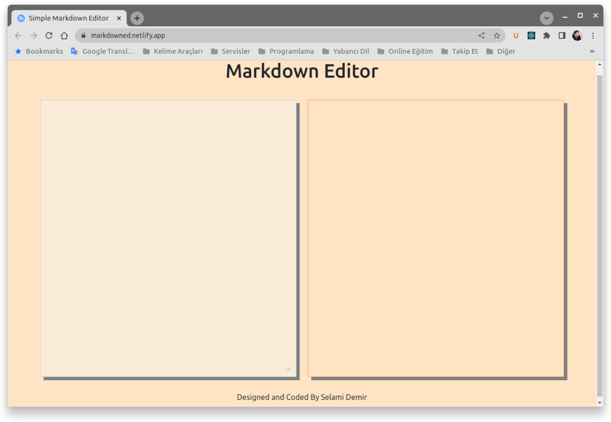
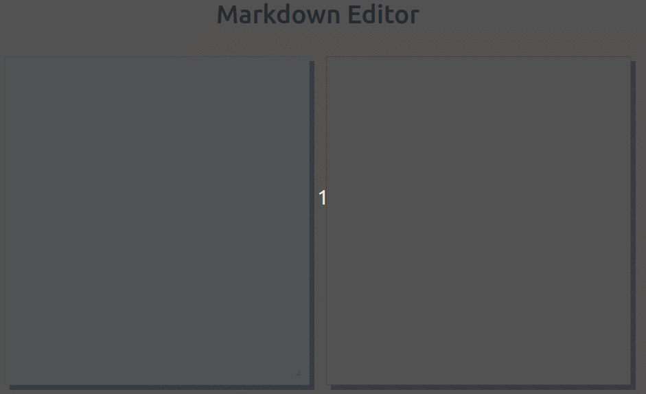

# Simple Markdown Editor with Preview

A simple editor developed with React JS and Redux for writing with Markdown. You can quickly write the texts you want using markdown marks.

## Demo

You can use the simple markdown editor from demo page.

[Demo](https://markdowned.netlify.app/ "Simple Markdow Editor")
[https://markdowned.netlify.app/](https://markdowned.netlify.app/)

  
## Used Technologies

- React, 
- Redux and Redux Tool Kit, 
- Marked JS,
- Html,
- Css

It was developed with React. Redux takes over the logic of the application.
UI was created Html and Css.

## Ekran Görüntüleri

  
## Rozetler

  
## Lisans

[MIT](https://choosealicense.com/licenses/mit/)

  